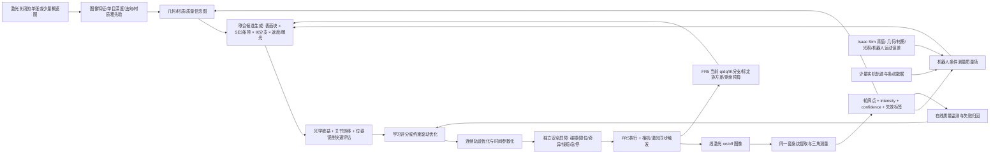

# 面向未知高反光工件的机械臂—线激光协同学习型主动建图研究方案

> 以“机械臂运动—线激光测量—在线重建”协同闭环为核心，基于现有法奥协作机械臂、海康黑白工业相机和 450 nm 单线激光平台的 Isaac Sim 6.0 / Isaac Lab 3.0 研究路线<br>
> 调研与方案日期：2026-07-17<br>
> 本文定位：科研可行性论证、技术路线和实验计划；基础几何与实机实施细节见同目录《机器人线激光三维扫描系统实施文档.md》。

---

## 0. 结论先行

### 0.1 总判断

这个方向**可行，而且比单纯复现线激光三角测量有明显更高的科研价值**。但论文问题不能写成“把线激光放进 Isaac Sim，再用强化学习扫一遍”，因为数字孪生、Next-Best-View（NBV）和强化学习路径规划都已有大量工作。建议将核心问题收敛为：

> **面向未知、无 CAD、高反光工业工件，如何用少量被动视觉观测建立粗先验，再联合优化机械臂关节轨迹、传感器观察/入射几何、扫描速度与成像参数，使机器人在可达、无碰撞、低反光失效的条件下，以尽可能少的运动获得完整、可信的高精度点云？**

建议的论文题目可以是：

> **面向未知高反光工件的机器人协同粗到细主动线结构光重建：可学习测量质量场与运动—感知联合规划**<br>
> *Robot-Coupled Reflectance-Aware Active Line-Structured-Light Reconstruction for Unknown Industrial Workpieces*

可行性和创新性分级如下。

| 内容 | 工程可行性 | 单独作为论文的创新性 | 判断 |
| --- | ---: | ---: | --- |
| 在 Isaac Sim 中复现相机、激光平面和机械臂 | 高 | 低 | 必须做，但只是基础设施 |
| 固定栅格或基于 CAD 的覆盖扫描 | 高 | 低 | 只能做基线 |
| 基于 TSDF/点云空洞的规则 NBV | 高 | 中低 | 已有成熟研究 |
| 只用通用 RL 学下一视点 | 中 | 中 | 已有 GenNBV 等代表工作 |
| RGB/灰度粗先验 + 线激光局部精扫 | 中高 | 中高 | 需要与不确定性和实机闭环结合 |
| 几何不确定性 + 反光失效风险联合规划 | 中 | 高 | 最值得作为主线 |
| 视点、机械臂构型、连续轨迹和成像时序联合优化 | 中 | 高 | 将“看哪里”提升为“怎样稳定地测到” |
| 在线条纹质量反馈驱动机械臂改姿、变速和重扫 | 中 | 高 | 最能体现具身主动测量与实机价值 |
| 从仿真学习、在真实高反光工件上零样本/少样本迁移 | 中低 | 高 | 最难，也是论文价值的关键 |
| 单张图精确反推出真实光源位置 | 低到中 | 中 | 问题病态，不宜作为主目标 |

综合判断：

- 若只做仿真中的规则扫描，科研价值约为 **2/5**。
- 若做通用学习型 NBV，但不建模线激光测量机理和反光，约为 **3/5**。
- 若完成“粗到细 + 机器人条件测量质量场 + 运动—感知联合策略 + 在线改姿重扫 + 实机 sim-to-real”，可达到 **4/5**，具备形成机器人/智能制造方向高质量论文的潜力。

### 0.2 对原始设想的四个必要修正

1. **“先拍一张图”可以作为概率先验，不能当成真实三维地图。** 单张图没有可靠的绝对尺度，也看不到背面和遮挡区域。最稳妥的是先采 3～8 个激光关闭的概览视图；若必须研究单图启动，则应输出深度、法向、材质和遮挡的概率分布，并保留高不确定性。
2. **不必先精确定位“反光源在哪里”，应优先预测“从候选姿态扫描会不会失败”。** 光源、几何和 BRDF 在单图下互相耦合，严格求解通常不唯一；而对路径规划真正有用的是候选姿态下的有效条纹概率、饱和风险、低信噪比和多径风险。
3. **学习策略不直接接管无约束的低层关节控制，但机械臂必须进入策略本身。** 关节状态、可达性、IK 分支、轨迹代价和执行不确定性进入信念状态与候选评分；策略联合选择下一块表面、观察/扫描方向、工作距离、速度和曝光。逆解连续性、碰撞、关节限位、速度/加速度限制和急停仍由确定性规划与机器人控制器强制保证。
4. **机械臂不能只是把传感器送到 NBV 的后端执行器。** 对线激光而言，传感器沿整条轨迹连续产生轮廓，机械臂构型、腕部滚转、扫描方向、速度、加速度、奇异位形距离和曝光同步都会改变点云质量。必须把候选视角、逆解分支、条带内连续轨迹和条带间转移代价放进同一个闭环，而不是先选“理想视点”、再碰运气求逆解。

### 0.3 最推荐的研究主线

建议按以下顺序推进，而不是一开始训练端到端 RL：

1. 先校准 FR5 的运动学、碰撞体、扫描头 TCP、手眼关系和曝光时刻位姿，使 Isaac Sim 中的机械臂轨迹能与真机坐标链逐姿态对齐。
2. 在 Isaac Sim 6.0 中建立“理想几何层—RTX 成像层—实机残差层”三级线激光数字孪生，同时模拟连续运动、位姿时间戳和条纹采样。
3. 实现固定蛇形、几何前沿、信息增益、反光角度启发式以及“笛卡尔 NBV 后求逆解”等基线。
4. 学习一个**轨迹条件的机械臂—传感器协同测量质量场**，预测候选机械臂构型和扫描轨迹下每个表面点的有效概率、误差方差与离群风险。
5. 用质量场加约束滚动优化联合决定目标表面块、腕部姿态、扫描方向、工作距离、速度和逆解分支；这是第一阶段最推荐的核心论文方案。
6. 再以该优化器生成专家示范，用模仿学习和约束强化学习学习长时序扫描顺序，在 Isaac Lab 中进行课程学习和域随机化。
7. 最后用真实钢件、铝件、V 形坡口、焊道和复杂曲面验证机械臂协同策略的 sim-to-real。

### 0.4 为什么机械臂协同必须成为主线

本系统中的机械臂不是普通移动平台，而是**测量仪器的可编程组成部分**。线激光的每个三维点都由机器人在曝光时刻给出的传感器位姿决定；机械臂动作还主动改变激光入射角、相机反射角、遮挡、条纹在曲面上的走向以及相邻轮廓间距。因此它至少承担六个不可替代的角色：

1. **几何激励器**：通过平移、俯仰、偏航和腕部滚转改变相机—激光—表面三者几何，使原本过曝、遮挡或多径的区域转为可测。
2. **连续采样器**：机械臂速度与相机帧率共同决定轮廓间距，曝光期间的运动决定运动模糊，轨迹曲率和加速度影响采样均匀性。
3. **主动标定载体**：有计划的多姿态激励可以提高相机—激光—法兰外参与时间偏移的可观测性，并暴露结构松动和系统误差。
4. **可达性约束来源**：同一个传感器位姿可能有多个逆解，后续可达范围、关节余量、奇异性、线缆扭转和过渡路径完全不同。
5. **风险规避执行体**：机器人能够在保持目标表面块不变时绕法向改变视角、缩短曝光、降速或反向重扫，这正是高反光场景中“主动”优于后处理的地方。
6. **效率优化载体**：扫描块的排序、条带方向和关节空间连续性决定大部分循环时间；只优化视点信息增益，可能得到无法连续执行或转场很慢的方案。

因此本课题更准确的学术定位不是“机器人搭载线激光”，而是：

> **机器人具身主动计量（embodied active metrology）：利用机械臂的运动自由度主动塑造光学测量条件，并由测量质量反过来驱动机械臂在线重规划。**

---

## 1. 现有平台能提供什么

### 1.1 已具备的硬件和数学基础

现有实施文档已经给出了一个完整的单线结构光系统，而不只是“相机光轴 + 激光平面”。关键条件包括：

| 模块 | 当前状态 | 对主动建图的意义 |
| --- | --- | --- |
| 机器人 | 法奥协作机械臂，眼在手上 | 可以主动改变观察方向、入射角和扫描方向 |
| 相机 | 海康 GigE 黑白相机，1440×1080，3.45 μm，约 65 fps | 可同时采激光关闭的灰度概览图和激光条纹图 |
| 镜头 | 6 mm，工作距离约 500 mm | 约 422×317 mm 大视场适合粗观察和较宽范围扫描 |
| 激光 | 450 nm、150 mW、单线、支持 TTL | 适合蓝光线结构光；后续可做曝光同步 |
| 几何 | 基线约 90 mm，光轴倾角约 10° | 可作为仿真初值，不能替代最终 6D 外参 |
| 单帧重建 | 去畸变像素射线与激光平面求交 | 可直接复用到仿真和实机的同一重建链 |
| 机器人位姿 | 法奥约 8 ms 位姿流 | 支持曝光时刻插值和移动扫描 |
| 每点质量 | intensity、confidence、饱和度、条纹宽度、拟合残差、时序连续性 | 是学习测量质量场的天然监督信号 |
| 目标精度 | 初期静态综合误差 0.2～0.5 mm | 可定义真实且可检验的几何评价阈值 |

已有坐标链为：

\[
{}^B\mathbf P=
{}^B T_F(t)\,{}^F T_C\,{}^C\mathbf P
\]

这条链应直接映射到 Isaac Sim 的 `world/base/flange/sensor/camera_optical` 层级。不能只输入激光平面和相机光轴；精确数字孪生至少还需要：

- 相机内参 \(K\) 和畸变 \(D\)；
- 激光平面 \((a,b,c,d)\) 及其标定协方差；
- 相机—激光完整 6D 安装关系；
- 法兰—相机手眼矩阵；
- TCP、工件坐标系和机器人时变位姿；
- 相机曝光中心、触发延时和位姿流时间模型。

### 1.2 与设想不完全匹配的地方

现有相机是黑白相机，所以它能提供灰度纹理、边缘、饱和区域和一定的材质线索，但不能直接提供彩色语义纹理。若安装了很窄的 450 nm 带通滤光片，激光关闭时的自然场景纹理还会进一步减弱。

建议有三种选择：

1. **最低成本路线**：保留现有相机，激光关闭时采灰度概览图，研究重点放在几何和反光风险，而不是复杂语义。
2. **推荐路线**：在传感器支架上增加一台刚性固定、全局快门的 RGB 概览相机；RGB 负责粗先验，现有黑白相机专门负责 450 nm 激光测量。
3. **增强路线**：增加 RGB-D/双目作为粗几何传感器，但必须承认它在镜面金属上也会丢深度，不能替代线激光。

固定基座机械臂只能探索其可达工作空间。论文宜使用“未知工件/工业工作单元主动重建”，而不是笼统宣称“整个大环境探索”。若目标扩展到房间或大型结构，还需地轨、龙门或移动底盘。

### 1.3 当前电脑与 Isaac Sim 6.0 的适配检查

2026-07-17 对本机做了只读检查：

| 项目 | 当前机器 | Isaac Sim 6.0 官方最低/测试配置 | 结论 |
| --- | --- | --- | --- |
| OS | Ubuntu 22.04.5 LTS | Ubuntu 22.04/24.04 | 满足 |
| CPU | Intel i7-14700，20 逻辑 CPU | 4 核起 | 满足 |
| 内存 | 31 GiB | 32 GB 最低，64 GB 更合适 | 刚到最低线，训练偏紧 |
| GPU | RTX 5060 Ti，16 GB VRAM | 官方表列 RTX 4080、16 GB | VRAM 到线，但 GPU 型号低于官方表列最低档 |
| 驱动 | 570.211.01 | 官方测试版本 580.95.05 | 需先做兼容性验证 |
| 磁盘 | 当前分区约 649 GB 可用 | 50 GB 最低，训练建议更大 | 满足原型需求 |
| ROS 2 | Humble 已安装 | Humble/Jazzy 推荐 | 满足 |

[Isaac Sim 6.0 官方系统要求](https://docs.isaacsim.omniverse.nvidia.com/6.0.0/installation/requirements.html)表明，多相机、高分辨率和 Isaac Lab 训练还会需要更多 RAM/VRAM。因此建议：

- 首先运行官方 Compatibility Checker，不要直接假设当前驱动和自定义内核组合稳定；
- 将内存升级到 64 GB；
- 本机先做单环境和低分辨率原型，批量 RTX 数据生成或大规模训练放到更强 GPU/远程工作站；
- 仿真训练不要与真实机器人实时控制同时满负载运行。

本机还存在 `/home/zhulong/IsaacLab-2.1.0`，并有 Isaac Sim 4.5 的运行日志；未发现独立的 Isaac Sim 6.0 安装。Isaac Lab 2.1 面向 Isaac Sim 4.5，不能直接当作 6.0 学习环境继续使用。Isaac Sim 6.0 应配套当前的 [Isaac Lab 3.0 beta2](https://isaac-sim.github.io/IsaacLab/release/3.0.0-beta2/source/refs/changelog.html) 系列，并固定确切版本或 Git 提交，因为 3.0 仍处在 beta 阶段且存在破坏性 API 变化。

### 1.4 现有 FR5 已经提供的机械臂协同起点

仓库中不是只有抽象的“法奥机械臂”描述，已经有一条可作为仿真—实机接口基线的 FR5 链路：

| 现有能力 | 当前实现 | 对本课题的价值与限制 |
| --- | --- | --- |
| 机器人模型 | `ros2_fr5` 中有 Fairino FR5 V6 URDF/STL | 可用于 Isaac 导入起点；当前模型只到 `wrist3_link`，没有经过实测验证的独立法兰 frame，不能直接把传感器挂在猜测位置 |
| 状态输出 | `/joint_states`、`/fairino/flange_pose`、`/fairino/flange_pose_mm_deg` | 可统一仿真/实机消息；当前默认 20 Hz 且是 PC 轮询时刻，适合 RViz/停稳扫描，不足以支持 30～65 fps 连续曝光插值 |
| 运动与停止 | 同一 SDK 会话的非阻塞 `MoveL`、`GetRobotMotionDone`、`StopMotion` | 已形成安全的异步控制雏形；仍没有碰撞规划、从当前位姿到起点的安全规划和连续曲线跟踪 |
| 当前扫描状态机 | 固定直线、固定起点姿态、逐点 MoveL、约 250 ms 停稳、采图前后读取法兰 | 是非常重要的 stop-and-shoot 实机基线，可验证几何链；它不是最终的连续学习扫描器 |
| 实际坐标链 | \({}^BT_C={}^BT_F{}^FT_C\) | 规划器输出目标相机位姿后，应反解 \({}^BT_F^*={}^BT_C^*({}^FT_C)^{-1}\)，再求 FR5 逆解 |
| 现有工作距离 | 当前标定数据的有效相机 Z 约为 484.408～557.135 mm | 应作为首版候选轨迹硬约束；重新标定或改变光学结构后必须随配置更新 |
| SDK 所有权 | Fairino SDK 3.9.4 同时只允许一个稳定 RPC 所有者 | 必须由单一 `robot_gateway` 独占真机连接，GUI、ROS、Isaac 和学习器通过 topic/action 共享，不能各自直连 |

在进入学习前，需先补齐或实测以下机械臂参数，未知项保持配置化，不能在仿真中填猜测值：

- 确切 FR5 硬件版本、基座安装、关节零位、关节/速度/加速度/急动度限制；
- `wrist3_link → reported_flange → sensor_mount → camera_optical` 的固定变换；
- 扫描头、支架、线缆、夹具和工件的碰撞几何；
- 不同构型、负载、速度下的 TCP 跟踪误差和重复定位统计；
- 控制命令延迟、状态缓存时间戳、相机设备时钟和曝光中心偏移；
- 机械臂本体/支架遮挡相机视场或截断激光平面的情况。

还需先解决一个真机接口风险：当前 ROS 状态节点为了规避 SDK 头文件/动态库 ABI 尺寸不一致，使用单项 getter 而不读取整包 `GetRobotRealTimeState()`；其他控制代码若仍调用整包状态接口，不能直接作为安全状态源。应先统一并验证 SDK 版本，再实现一个单所有者、可停止、可审计的机器人网关。软件 `StopMotion` 仍不能替代控制柜物理急停。

当前 `myline_hik/config/hik_handeye.yaml` 记录的基板平移一致性残差约为 RMS 0.873 mm、P95 1.440 mm。这个指标不是最终点云绝对精度，也不能与激光平面 RMS 混用；但它提示现有手眼链在声称 0.2～0.5 mm 主动建图前仍需独立复核。机械臂协同策略若建立在偏差外参上，会把系统误差稳定地带到所有“最优”轨迹中。

---

## 2. 研究问题的严格定义

### 2.1 从“复现传感器”提升为主动感知问题

场景中存在未知表面几何 \(G\)、空间变化材质 \(M\)、环境照明 \(L\) 和机器人状态 \((q_t,\dot q_t)\)。机器人执行的不是离散“拍照动作”，而是一段带成像调度的关节轨迹：

\[
\tau_t=\{q(\xi),\dot q(\xi),\ddot q(\xi),e(\xi),p_L(\xi)\}_{\xi\in[0,T_t]}
\]

其中 \(e\) 是曝光参数，\(p_L\) 是激光功率或档位。传感器的连续位姿由

\[
{}^B T_C(\xi)=\mathrm{FK}(q(\xi))\,{}^F T_C
\]

唯一决定，并在运动过程中连续产生激光图像、轮廓与质量观测 \(o_t\)。目标是在有限时间和运动预算内联合求解扫描原语序列、逆解分支和各原语内轨迹：

\[
\pi^*=arg\max_\pi
\mathbb E\left[
\alpha C_\epsilon
-\beta E_\mathrm{geom}
-\gamma T
-\eta L_\mathrm{path}
-\kappa R_\mathrm{reflect}
-\lambda R_\mathrm{safety}
-\mu R_\mathrm{motion}
-\nu R_\mathrm{pose}
\right]
\]

其中：

- \(C_\epsilon\)：在误差阈值 \(\epsilon\) 内被可信重建的表面覆盖率；
- \(E_\mathrm{geom}\)：几何误差与不确定性；
- \(T\)：总采集时间；
- \(L_\mathrm{path}\)：机械臂路径长度或能耗代理；
- \(R_\mathrm{reflect}\)：过曝、低信噪比、多径和假条纹风险；
- \(R_\mathrm{safety}\)：碰撞、不可达、关节限位、奇异位形和最小安全距离惩罚。
- \(R_\mathrm{motion}\)：关节行程、速度、加速度、加加速度、能耗代理和逆解分支跳变；
- \(R_\mathrm{pose}\)：机器人重复定位、手眼外参和曝光同步传播到三维点后的位姿误差。

未知几何和材质使问题本质上是部分可观测决策过程。实际系统不需要显式求解完整 POMDP，但必须维护一个随扫描更新的信念状态，而不能只把当前一张图送进策略网络。

与此同时，所有输出轨迹必须满足硬约束：

\[
\begin{aligned}
q^-&\le q(\xi)\le q^+, & |\dot q|&\le \dot q^+, & |\ddot q|&\le \ddot q^+,\\
d_\mathrm{collision}(q)&\ge d_\mathrm{safe}, & m(q)&\ge m_\mathrm{min}, & h^-&\le h(q,G)\le h^+,\\
\theta_\mathrm{view}&\in\Theta_\mathrm{valid}, & v(\xi)t_\mathrm{exp}&\le b_\mathrm{max}, & \Delta s&=v/f_c\le \Delta s_\mathrm{max}.
\end{aligned}
\]

其中 \(m(q)\) 是可操作度，\(b_\mathrm{max}\) 是允许的曝光期运动距离，\(\Delta s\) 是相邻线轮廓间距。高层学习器不能用奖励“软学会”这些底线约束，必须由候选掩码、安全投影和控制器共同保证。

### 2.2 建议维护的双重不确定性

应明确区分两类不确定性：

1. **几何不确定性 \(U_g(\mathbf x)\)**：某个空间位置是否存在表面、表面位置和法向有多不确定、是否从未观测或只有单侧观测。
2. **测量不确定性 \(U_m(\mathbf x,\mathbf v,q,\dot q,e)\)**：从候选传感器姿态和机械臂运动状态测量表面点 \(\mathbf x\) 时，条纹是否有效、深度方差多大、是否可能产生离群点。

普通 NBV 主要优化第一类；本课题的科研增量应放在第二类及二者的联合决策上。高反光不是表面的固定标签，而是随视角、激光入射方向、相机方向、表面法向、粗糙度和照明共同变化的条件风险。

### 2.3 “反光源推理”应如何重新表述

从单张图同时求表面几何、BRDF 和真实照明通常是不适定的。更可执行的分层目标是：

- 第一层：从概览图检测高光、饱和、低纹理和可能的金属区域；
- 第二层：结合首批激光轮廓估计局部表面法向和视角相关失效概率；
- 第三层：预测每个候选扫描姿态的条纹质量，直接用于避障和避反光；
- 可选第四层：积累多视图后再用逆渲染估计环境光场和材质参数，作为辅助解释，而非路径规划的必要前置条件。

这样既保留了“推理反光来源”的先进性，又避免把整个项目押在一个病态逆问题上。

### 2.4 机械臂协同带来的第三类不确定性

除几何和光学测量不确定性外，还应显式维护**运动实现不确定性** \(U_r(\tau)\)。它来自机器人绝对定位误差、不同构型下的柔顺/回差、接近奇异位形时的速度放大、手眼外参误差、时间同步误差以及扫描头结构振动。最终点的协方差可近似传播为：

\[
\Sigma_{P_B}
\approx J_\mathrm{tri}\Sigma_\mathrm{img,plane}J_\mathrm{tri}^{T}
+J_\mathrm{pose}\Sigma_{T(q,t)}J_\mathrm{pose}^{T}
\]

这意味着同一个表面块即使光学上可见，从不同机械臂构型和运动速度到达时，也可能产生不同的毫米级误差。推荐把候选动作的质量拆成三项：

\[
U(a)=I_\mathrm{geom}(a)\cdot P_\mathrm{valid}(a)
-\lambda_c C_\mathrm{joint}(a)
-\lambda_r U_r(a)
\]

- \(I_\mathrm{geom}\)：预计消除的几何熵或覆盖增益；
- \(P_\mathrm{valid}\)：线激光在该视角、速度和曝光下的有效概率；
- \(C_\mathrm{joint}\)：当前构型到候选轨迹的真实关节空间代价；
- \(U_r\)：该轨迹的实现和位姿传播不确定性。

这正是机械臂协同的科学价值：把传统 NBV 的“相机应该去哪儿”变成“机器人以哪一个构型、沿哪一条连续轨迹、用什么速度和成像参数去测，才能得到可计量的数据”。

---

## 3. 现有研究进展与真正空白

### 3.1 主动三维重建：从规则 NBV 到学习和神经场

| 工作 | 年份/出处 | 主要进展 | 对本项目的启发与不足 |
| --- | --- | --- | --- |
| [SCONE](https://proceedings.neurips.cc/paper_files/paper/2022/hash/828c6d69bdf91fca7f2b97c4dc214e94-Abstract-Conference.html) | NeurIPS 2022 | 用体积表示学习未知表面的覆盖收益 | 可借鉴覆盖评分，但不是线激光和反光模型 |
| [ActiveNeRF](https://arxiv.org/abs/2209.08546) | ECCV 2022 | 用 NeRF 不确定性选择增量视图 | 更偏稀疏图像选择，没有机器人安全轨迹和计量约束 |
| [NeurAR](https://kingteeloki-ran.github.io/NeurAR/) | RA-L 2023 | 将神经不确定性用于自主重建和路径规划 | 证明“学不确定性比手工评分更有价值” |
| [MACARONS](https://openaccess.thecvf.com/content/CVPR2023/html/Guedon_MACARONS_Mapping_and_Coverage_Anticipation_With_RGB_Online_Self-Supervision_CVPR_2023_paper.html) | CVPR 2023 | 只用 RGB 在线自监督学习大场景占据和 NBV | 支持“先用图像建立粗先验”，但不提供工业计量精度 |
| [GenNBV](https://openaccess.thecvf.com/content/CVPR2024/html/Chen_GenNBV_Generalizable_Next-Best-View_Policy_for_Active_3D_Reconstruction_CVPR_2024_paper.html) | CVPR 2024 | RL 学习可泛化的 5D 自由空间 NBV 策略，并使用 Isaac Gym | 说明学习路径已非空白；需在线激光机理和反光上形成区别 |
| [NARUTO](https://openaccess.thecvf.com/content/CVPR2024/html/Feng_NARUTO_Neural_Active_Reconstruction_from_Uncertain_Target_Observations_CVPR_2024_paper.html) | CVPR 2024 | 混合神经表示、学习不确定性、目标搜索和路径规划 | 双层不确定性设计的重要参考，但传感器是常规 RGB-D/渲染观测 |
| [Neural Visibility Field](https://openaccess.thecvf.com/content/CVPR2024/html/Xue_Neural_Visibility_Field_for_Uncertainty-Driven_Active_Mapping_CVPR_2024_paper.html) | CVPR 2024 | 将可见性和 NeRF 不确定性用于主动视点选择 | 可借鉴视角条件不确定性，而非直接照搬表示 |
| [ActiveSplat](https://li-yuetao.github.io/ActiveSplat/) | RA-L 2025 | 混合稠密 3DGS 与稀疏拓扑图，统一在线建图、视点和路径 | 适合做外观/高光地图参考，但 3DGS 不宜作为毫米级几何真值 |
| [AREA3D](https://openaccess.thecvf.com/content/CVPR2026/html/Xu_AREA3D_Active_Reconstruction_Agent_with_Unified_Feed-Forward_3D_Perception_and_CVPR_2026_paper.html) | CVPR 2026 | 前馈 3D 感知、不确定性与视觉语言高层引导 | 表明领域已进入基础模型引导阶段；本项目应保持工业传感器特异性 |

这条文献线说明：通用主动重建已经从手工体素增益发展到神经不确定性、3DGS、RL 和视觉语言引导。因此，“用学习方法做 NBV”本身不是足够强的创新点。

### 3.2 工业线激光扫描路径：仍以模型和规则为主

| 工作 | 主要方法 | 局限 |
| --- | --- | --- |
| [Uncertainty-Based Autonomous Path Planning for Laser Line Scanners](https://doi.org/10.3390/metrology2040028) | 2022，数字孪生中依据任务测量不确定性和传感器约束生成路径 | 依赖 CAD/公差先验，非未知场景和学习策略 |
| [The Surface Edge Explorer](https://doi.org/10.1177/02783649241230098) | 2024，直接依据测量密度和表面边界选择 NBV，并在机械臂实机验证 | 通用 3D 传感器，未显式处理线激光高反光 |
| [Research on Path Planning Technology of a Line Scanning Measurement Robot Based on the CAD Model](https://doi.org/10.3390/act13080310) | 2024，基于 CAD 的线扫描测量机器人路径规划 | 典型规则/模型路线，无法处理无 CAD 工件 |
| [Boundary Exploration NBV](https://arxiv.org/abs/2412.10444) | 2024，点云边界探索，并学习边界候选评分 | 对未知物体有价值，但没有光学测量失效模型 |
| [Measurability and measurement path planning of multi-line structured light 3D profiling](https://doi.org/10.1016/j.measurement.2026.121172) | 2026，用可测性准则和蚁群优化降低多线扫描遗漏 | 仍是显式准则和组合优化，不是反光感知在线学习 |
| [Automated line scan profilometer based on the surface recognition method](https://doi.org/10.1016/j.optlaseng.2024.108464) | 2024，先用面结构光识别表面，再由高精度线结构光扫描自由曲面和反射镜 | 与“粗传感器 + 精线扫”很接近，但路径仍由显式表面模型生成 |
| [Reinforcement Learning Approach to Optimizing Profilometric Sensor Trajectories](https://arxiv.org/abs/2409.03429) | 2024，在 CAD 仿真上用 PPO 优化轮廓传感器轨迹，并在 UR3e 执行 | 证明 RL 可用于线扫，但依赖 CAD、离线轨迹和简化噪声 |
| [High accuracy measurement path planning of robot optical measurement system](https://doi.org/10.1016/j.measurement.2025.118639) | 2025，用高斯过程预测测量不确定性，并以序列凸优化兼顾精度和效率 | 已触及“质量模型 + 轨迹优化”，但依赖已知自由曲面且不处理在线未知反光 |
| [Curvature-adaptive scanning path planning of robot optical measurement](https://doi.org/10.1016/j.rcim.2026.103274) | 2026，按曲率生成视点，再在关节空间优化姿态和顺序 | 清楚说明视点序列与机器人构型必须协同，但仍是模型驱动、先表面后轨迹 |

所以用户的观察基本成立，但应更精确地表述为：

> **在通用主动重建领域，学习型路径已经很活跃；而在工业机器人线激光计量中，实际可用的方法仍大量依赖 CAD、视场/入射角规则、覆盖启发式和离线优化。**

#### 3.2.1 机械臂协同方面的关键进展与缺口

机器人主动重建已经认识到信息收益不能脱离运动代价。[Reconstruction-Aware Trajectory Optimization](https://arxiv.org/abs/1905.03907) 在操纵过程中把轨迹与重建熵联合考虑；[Pred-NBV](https://arxiv.org/abs/2304.11465) 将控制代价加入 NBV；工业测量研究则逐步把关节限位、姿态平滑和测量不确定性加入路径优化。另一方面，[Modeling and compensation of measurement errors in hand-eye systems](https://doi.org/10.1016/j.rcim.2025.103155) 表明连续机器人线扫还会受到几何误差、关节变形和外参误差共同影响。

| 代表工作 | 机械臂协同进展 | 尚未解决的部分 |
| --- | --- | --- |
| [MA-NBCP](https://doi.org/10.1109/LRA.2024.3375261) | 将信息增益与机械臂操作度结合，直接规划 Next-Best-Configuration | 深度相机、离散视角；没有线激光连续轨迹、曝光和反光失效 |
| [NBV/NBC Planning Considering Confidence From Shape Completion](https://doi.org/10.1109/LRA.2024.3358753) | 用形状补全置信度引导视图/构型，面向缺失严重的光亮薄曲面物体 | 未显式建模条纹饱和、多径、扫速和连续轨迹误差 |
| [Visual Servoing-Based Active Vision for 3D Object Reconstruction](https://doi.org/10.1109/LRA.2025.3641435) | 将连续 NBV 与 eye-in-hand 视觉伺服统一，得到平滑闭环探索轨迹 | 常规视觉重建；没有工业线激光的计量精度和成像参数协同 |
| [RL-Based Profilometric Sensor Trajectory Optimization](https://doi.org/10.3390/s25072271) | 用 PPO 优化轮廓传感器的距离、倾角和扫描间距，并做机器人验证 | 轨迹仍以 CAD/离线仿真为基础，缺少未知工件在线质量反馈 |
| [Adaptive Exposure Control for Line-Structured Light](https://doi.org/10.3390/s25041195) | 证明条纹质量可用于在线调曝光 | 曝光与机械臂姿态、速度和扫描方向仍是分离决策 |

但这些工作通常停留在以下两种割裂范式之一：

- **先感知后运动**：先在笛卡尔空间选最佳视点，再做逆解和碰撞规划；不可达、逆解跳变和长转场只在末端被动处理。
- **先模型后轨迹**：基于已知 CAD/完整点云离线生成覆盖路径，再优化关节行程；缺少未知工件的在线质量反馈。

本课题应瞄准二者之间尚未充分解决的闭环：**当前条纹质量改变下一条机器人轨迹，而机器人实际构型、速度和轨迹又改变下一批条纹的质量**。这不是把碰撞惩罚加到 RL 奖励中，而是运动学、动力学、光学和重建信念的联合决策。

### 3.3 高反光感知：从后处理走向视角条件预测

| 工作 | 核心结论 | 与本项目的关系 |
| --- | --- | --- |
| [Modeling outlier formation in scanning reflective surfaces using a laser stripe scanner](https://doi.org/10.1016/j.measurement.2014.08.010) | 混合反射和多径反射会在成像阵列中制造假峰，形成大误差离群点 | 说明反光不只是“缺点”，还会产生错误点，应进入风险模型 |
| [DREDS](https://pku-epic.github.io/DREDS/) | ECCV 2022，用物理渲染和域随机化模拟高反光/透明物的主动立体深度退化 | 支持“仿真成像 + 真实退化校准”的路线 |
| [Polarization Image Laser Line Extraction Methods for Reflective Metal Surfaces](https://doi.org/10.1109/JSEN.2022.3194258) | 用偏振图像改善蓝色线激光在金属表面的条纹提取 | 可作为后续硬件增强和强基线 |
| [Next-Best-View Prediction for Active Stereo Cameras and Highly Reflective Objects](https://arxiv.org/abs/2202.13263) | 用 Phong 反射和相机响应预测候选视角信息增益 | 已证明“反光模型参与 NBV”可行，但依赖 CAD 和主动双目 |
| [Active Pose Refinement for Textureless Shiny Objects](https://arxiv.org/abs/2308.14665) | 用可微渲染预测未来视角的深度不确定性，再做 NBV | 与本课题最接近，但目标是已知物体位姿精化，而非未知工件完整重建 |
| [NeRO](https://doi.org/10.1145/3592134) | SIGGRAPH 2023，多视图恢复反射物几何、BRDF 和未知环境光 | 可作为多视图逆渲染参考，不适合直接放在实时控制内环 |
| [NeILF++](https://openaccess.thecvf.com/content/ICCV2023/html/Zhang_NeILF_Inter-Reflectable_Light_Fields_for_Geometry_and_Material_Estimation_ICCV_2023_paper.html) | ICCV 2023，联合估计几何、材质、入射光和互反射 | 支持把环境照明建成可学习场，但计算复杂 |
| [Center extraction method for reflected metallic surface fringes](https://opg.optica.org/josaa/abstract.cfm?uri=josaa-41-3-550) | 2024，自适应分割和梯度加权改善金属表面亚像素中心 | 可作为真实条纹提取基线 |
| [Method for restoring point cloud information from complex reflective surface line structured light scans](https://doi.org/10.1016/j.optlastec.2024.112316) | 2025，用注意力特征融合识别反射条纹并修复点云孔洞 | 代表后处理路线；主动换姿态应优先于无依据补洞 |

### 3.4 本课题可以占据的研究空白

现有工作分别解决了学习型 NBV、线激光路径、高反光深度和逆渲染，但下面这个交叉点仍然有明确空间：

- 未知工件、无 CAD；
- 机械臂眼在手单线结构光，而不是普通 RGB-D、双目或 LiDAR；
- 从被动图像粗先验到局部高精度线扫的多尺度闭环；
- 显式预测候选视角下的有效条纹概率、误差和离群风险；
- 联合选择表面块、传感器位姿、逆解分支、连续条带、扫描速度与成像参数；
- 学习策略与机械臂可达、碰撞、工作距离、入射角、运动平滑、线缆和时序同步的硬约束结合；
- 执行中由真实条纹质量触发腕部改姿、变速、反向扫描或局部重扫；
- Isaac Sim 训练后，在真实钢/铝高反光工件上验证完整性、精度和效率。

真正有力的论文贡献不是把几种模块串起来，而是提出一个能被定义、监督、校准和消融的核心量：

> **机器人条件线激光测量质量场** \(Q_\theta(\mathbf x,\mathbf v,q,\dot q,e\mid I_0,\mathcal M_t)\)。

它输出从候选视角和机械臂轨迹状态测量表面点 \(\mathbf x\) 时的有效概率、深度方差、饱和概率和离群概率，并与几何信息增益、关节空间代价和位姿误差一起驱动扫描规划。

---

## 4. 推荐系统架构



关键变化是：可达性、IK 分支、关节转移、奇异性和轨迹质量在**候选评分前**就参与决策；最后的安全屏障是独立的二次防线，而不是机械臂唯一出现的位置。若仍采用“先选最优视点 → 再尝试逆解 → 失败后换下一个”的串联结构，就不能充分体现机械臂协同。

### 4.1 地图不要只选一种表示

建议使用混合地图：

- **TSDF/占据栅格**：用于已知/未知空间、碰撞和覆盖率；
- **Surfel/网格**：用于表面法向、局部曲率、视角和扫描条带生成；
- **质量体/表面属性**：保存观测次数、强度、置信度、饱和率、条纹宽度、残差、有效率和反光风险；
- **机器人信念状态**：保存当前关节构型、当前 IK 分支、关节余量、最小可操作度、轨迹跟踪误差统计、手眼/时间同步协方差和线缆状态；
- **可选 3DGS/神经外观场**：表达视角相关高光和生成候选视图，但不作为毫米级几何真值。

每个表面元素建议至少保存：

```text
position, normal, covariance,
coverage_count, best_incidence_angle,
intensity_mean, saturation_rate,
stripe_width, center_fit_residual,
valid_probability, outlier_probability,
last_view_direction, material_embedding
```

### 4.2 动作不应是裸关节力矩，而应是“扫描原语”

推荐将一个高层动作定义为一条可执行扫描原语：

\[
a_t=(\Omega_t,\Gamma_t^{SE(3)}(s),\nu_t(s),\rho_t,m_t)
\]

其中：

- \(\Omega_t\)：本次要补测的表面区域；
- \(\Gamma_t^{SE(3)}(s)\)：传感器从进近、有效扫描到退出的连续位置/姿态曲线；
- \(\nu_t(s)\)：轨迹时间参数化，即扫描速度、加减速和必要的停稳点；
- \(\rho_t\)：IK 分支、进近方向和允许的观察姿态松弛范围；
- \(m_t\)：曝光、增益、激光功率及 on/off 采集模式。

这样动作与实际工艺一致，也显著降低学习难度。策略从联合候选中选择，低层再用 cuMotion、MoveIt 2 或自有优化器求连续关节轨迹并由安全屏障复核。现有 FR5 是六轴机械臂，不能把它写成具有任意连续零空间冗余；这里主要搜索离散 IK 分支、进近方向以及任务允许的传感器姿态容差。若未来换成七轴机械臂，才可进一步研究连续零空间优化。

### 4.3 在线循环

```text
概览图建立粗先验
→ 机械臂执行规则安全初扫得到种子几何
→ 更新几何/反光/机器人实现不确定性
→ 联合生成“目标块 + SE(3)条带 + IK分支 + 速度/曝光”候选
→ 预测几何收益、条纹成功率、点云误差和关节转移代价
→ 约束滚动优化选择并时间参数化轨迹
→ 独立安全屏障复核后执行
→ 执行中按真实条纹质量继续、降速、改姿、重扫或停止
→ 更新地图、质量场和机器人误差统计
→ 达到覆盖、精度或时间预算后停止
```

终止条件不能只有“没有未知体素”，还应包括：

- 误差阈值内覆盖率达到目标；
- 新动作的期望信息增益低于阈值；
- 关键区域的不确定性满足任务要求；
- 时间、路径长度或曝光次数达到预算；
- 剩余区域被判定为当前硬件不可测，并输出不可测掩码。

### 4.4 四层机械臂协同架构

| 层级 | 决策周期 | 机械臂与感知如何协同 | 推荐实现 |
| --- | --- | --- | --- |
| 任务层 | 每条带/每区域 | 选择下一表面块、粗视角族和扫描模式 | patch graph + Transformer/GNN 或启发式信息增益 |
| 轨迹层 | 每条带 | 联合选择 SE(3) 曲线、IK 分支、进近/退出、速度和曝光 | 约束 MPC、轨迹优化、beam search |
| 执行层 | 控制周期 | 跟踪轨迹并同步相机曝光、激光 TTL 和实际位姿 | cuMotion/MoveIt 规划 + FR5 非阻塞控制 |
| 监测层 | 每帧 | 判断饱和、断线、多峰、运动模糊和位姿错配，触发局部重规划 | 条纹质量监测器 + 独立安全状态机 |

学习主要进入任务层、候选评分和质量预测；执行层必须是确定性控制，监测层有权覆盖学习决策并停止扫描。这种分工既突出机械臂的决策作用，也不牺牲真机安全。

---

## 5. 轨迹条件的机械臂—传感器协同测量质量场

### 5.1 预测目标

对表面点 \(\mathbf x\)、候选传感器轨迹 \(\Gamma\)、关节状态和成像模式，网络输出：

\[
Q_\theta(\mathbf x,\Gamma,q,\dot q,m)=
\left[
p_\mathrm{valid},
\sigma_z,
p_\mathrm{sat},
p_\mathrm{lowSNR},
p_\mathrm{multipath},
p_\mathrm{outlier},
p_\mathrm{occlusion},
p_\mathrm{track}
\right]
\]

为保持可解释性，可以把联合质量写成若干可校准因子的组合：

\[
Q^\mathrm{joint}
=Q^\mathrm{optical}(\mathbf x,T_C,m)
\cdot Q^\mathrm{visibility}(\mathbf x,\Gamma)
\cdot Q^\mathrm{robot}(q,\dot q,\ddot q)
\cdot Q^\mathrm{calib}(\Sigma_q,\Sigma_{FC},\Delta t)
\]

网络不必真的强制四项完全独立；该分解的价值在于可以分别校准和消融“光学失败”“遮挡失败”“轨迹执行失败”和“标定/同步误差”。

输入可以包括：

- 概览图或局部图像特征；
- 当前表面点、法向、曲率和几何协方差；
- 相机观察方向、激光入射方向和半程向量；
- 当前工作距离、曝光、激光功率；
- 历史视角下的亮度、饱和、条纹宽度和拟合残差；
- 材质/粗糙度隐变量和环境光编码；
- 当前与候选关节角、IK 分支、关节余量、Jacobian 奇异值和关节转移距离；
- 候选轨迹的速度、加速度、急动度、进近方向、扫描方向和预计过渡时间；
- 机器人位姿、手眼外参和曝光时间偏移的协方差；
- 机械臂本体、夹具、线缆和扫描头对相机/激光的动态遮挡特征。

### 5.2 监督信号

仿真中可由几何真值和 RTX 成像同时产生标签：

- 理想激光平面与表面真实交线；
- 条纹中心提取是否成功；
- 重建点与真实表面的误差；
- 是否过曝、过暗、断线、产生双峰/多峰；
- 直接光与多径贡献之比；
- 材质、法向、光源和候选姿态真值。
- 计划与实际 TCP 轨迹误差、最小可操作度、IK 分支和控制延迟；
- 曝光期间的 TCP 位移、相邻轮廓间距、运动模糊和仿真时间戳偏差；
- 由已知真值计算的机械臂自遮挡、碰撞距离及轨迹是否完整执行。

实机中可用以下方式生成少量高质量标签：

- 同一工件多姿态重复扫描的一致性；
- 正反向扫描重合误差；
- 标准平面、台阶、球和 V 槽的外部真值；
- 对照喷粉/消光后的参考扫描或 CMM/高精度扫描仪真值；
- 人工审核的有效条纹、饱和、假峰和多径掩码。
- 同一末端扫描几何在不同 IK 分支、速度、进近方向下的重复试验；
- 控制器目标轨迹与实际法兰位姿流的跟踪残差和到位时间；
- 正反向扫描同一标准平面后，由错层估计的时间同步和运动方向相关误差。

质量场必须回答三个专门体现机械臂协同的问题：

1. 相近末端观察几何由不同 IK 分支实现时，哪一个分支具有更低的位姿误差和更好的后续可达性？
2. 同一条带以不同速度/加速度执行时，有效点率、轮廓间距和三维误差如何变化？
3. 当前条纹发生失效后，改变腕部方位、扫描方向、进近路径或速度，哪一个动作最可能恢复有效测量？

### 5.3 为什么它比直接做“光源定位”更合理

即使环境光位置估错，只要网络能准确预测候选姿态的测量成功率，路径仍然正确。反过来，即使恢复了漂亮的环境光图，如果无法预测线激光条纹是否饱和或产生假峰，也不能改善点云。

光源/BRDF 逆渲染可作为辅助任务：

\[
\mathcal L=
\mathcal L_\mathrm{quality}
+\lambda_1\mathcal L_\mathrm{radiance}
+\lambda_2\mathcal L_\mathrm{material}
+\lambda_3\mathcal L_\mathrm{calibration}
\]

多任务学习可能提高可解释性和跨光照泛化，但主评价指标仍应是测量质量预测和最终重建质量，而不是渲染 PSNR。

### 5.4 模型形式与不确定性

推荐将当前地图划分为表面 patch 图，每个 patch 是一个节点，候选机器人扫描原语是另一组节点，形成二部图。使用 GNN 或交叉注意力 Transformer 聚合以下关系：

- patch 的几何、材质和观测历史；
- 候选轨迹覆盖哪些 patch；
- 当前关节构型到候选 IK 分支的转移代价；
- 候选之间是否共享安全进近段或造成后续死角。

质量预测建议使用深度 ensemble 或异方差分布头，同时输出均值和认知不确定性。仿真从未覆盖的材质、构型或轨迹应得到较高不确定性，并触发保守规则扫描或人工确认，而不是让策略把过度自信的分数直接送给真机。

---

## 6. 机械臂—传感器协同扫描模型

### 6.1 连续运动观测模型

第 \(k\) 帧图像的观测不是由一个理想离散视点产生，而由曝光中心时刻的实际机械臂位姿产生：

\[
y_k=h\!\left(
G,M,L,
{}^BT_F(q(t_k+\Delta t_k)){}^FT_C,
\Pi_L,
m_k
\right)+\epsilon_k
\]

其中 \(\Pi_L\) 是相机坐标系中的激光平面，\(\Delta t_k\) 是相机与机器人时间偏移。规划器若给出目标相机轨迹 \({}^BT_C^*(s)\)，对应法兰轨迹应先由

\[
{}^BT_F^*(s)={}^BT_C^*(s)({}^FT_C)^{-1}
\]

求出，再搜索满足整条轨迹连续性的 IK 分支。不能把相机光心轨迹直接当作法兰或 TCP 轨迹。

### 6.2 从表面条带到连续关节轨迹

每个待测表面 patch 不只生成一个法向视点，而应生成一族联合候选：

```text
表面 patch
→ 若干扫描方向和条带覆盖方式
→ 若干观察/入射角与工作距离
→ 进近—有效扫描—退出的 SE(3) 曲线
→ 每个离散轨迹点的全部可用 IK 解
→ 用动态图/动态规划连接连续 IK 分支
→ 时间参数化并进行碰撞、奇异、线缆和视场检查
```

候选的评价发生在关节空间而不只是末端空间。两个几乎相同的相机视角，可能因为 IK 分支不同而具有完全不同的转场时间、关节余量和后续覆盖能力。推荐将“当前构型—候选条带—候选终态”组成有向图，用 beam search、动态规划或短时域 MPC 同时优化当前收益和后续可达性。

### 6.3 速度、帧率、曝光和采样密度协同

连续线扫必须同时满足：

\[
\Delta s=\frac{v_\mathrm{surface}}{f_\mathrm{camera}}
\le \Delta s_\mathrm{max}
\]

\[
b=\left\|J_C(q)\dot q\right\|t_\mathrm{exp}
\le b_\mathrm{max}
\]

第一式控制相邻轮廓间距，第二式控制曝光期间传感器运动距离。现有实施文档给出的示例是 60 fps、10 mm/s 时约 0.17 mm 线间距；但真实表面速度还受机械臂姿态变化影响，不能只使用法兰平移速度。

推荐采用质量自适应时间参数化：

- 平坦、漫反射、远离奇异位形的区域可提高扫描速度；
- 高曲率、窄槽、条纹弱或跟踪误差大的区域降低速度；
- 过曝优先降低曝光/激光功率或改变姿态，不应仅靠降速；
- 低信噪比需要延长曝光时，应同步降速以限制运动模糊；
- 加速和减速段可不计入正式计量，或单独使用更严格的位姿误差模型。

### 6.4 机械臂误差必须进入点云计量模型

更完整的一阶误差传播可以写成：

\[
\Sigma_{P_B}\approx
J_z\Sigma_zJ_z^T+
J_{\Pi}\Sigma_{\Pi}J_{\Pi}^T+
J_q\Sigma_qJ_q^T+
J_{FC}\Sigma_{FC}J_{FC}^T+
J_{\Delta t}\sigma_{\Delta t}^2J_{\Delta t}^T
\]

五项分别对应条纹中心、激光平面、机器人位姿、手眼外参和时间同步误差。研究中至少要测量而不是假设：

- FR5 在不同工作空间位置、姿态、方向和速度下的实际法兰重复性；
- 同一路径正向/反向扫描标准平面的系统错层；
- 静态 stop-and-shoot 与连续扫描的误差差值；
- 手眼矩阵扰动对边缘、斜面和远离光心区域的误差放大；
- 轨迹跟踪误差与 Jacobian 条件数、速度和加速度的相关性。

若点云误差主要由机械臂绝对定位或时间同步主导，就应优先做在线位姿补偿/外部跟踪，而不是继续堆叠更复杂的 NBV 网络。

### 6.5 硬约束、软代价与安全屏障的边界

| 类型 | 项目 | 处理方式 |
| --- | --- | --- |
| 硬约束 | 关节限位、速度/加速度上限、碰撞距离、有效工作距离、相机/激光可见、控制器状态 | 候选生成和轨迹优化中强制满足 |
| 硬约束 | 物理急停、保护区、人员进入、通信失联、SDK 异常 | 独立安全状态机直接停止，不交给学习器 |
| 风险约束 | 奇异性、位姿协方差、线缆扭转、机械臂/支架自遮挡 | 设安全阈值；接近阈值的候选禁用或降级 |
| 软代价 | 关节行程、循环时间、急动度、能耗代理、IK 分支切换 | 进入候选评分与长期策略 |
| 学习量 | 条纹有效率、反光离群概率、预计深度方差、重扫收益 | 由质量场预测并带校准置信度 |

学习器可以决定“在安全集合中哪个动作更有价值”，不能决定哪些动作是安全的。

### 6.6 机械臂、夹具和线缆也会造成可见性问题

Isaac Sim 场景必须包含扫描头外壳、机械臂连杆、相机支架、激光器、夹具和主要线缆包络。否则策略会学会现实中会被本体遮挡、碰撞或扭线的姿态。首版可把线缆建成保守的扫掠包络或关节累计转角约束，不必一开始做高成本柔性线缆动力学。

---

## 7. 分层学习与运动—感知联合规划

### 7.1 信念状态

建议策略状态明确包含机械臂和计量链：

\[
b_t=\{\mathcal M_t^g,\mathcal M_t^m,\mathcal H_t,
q_t,\dot q_t,\Sigma_{q,t},
{}^FT_C,\Sigma_{FC},\Delta t_t,c_t,B_t\}
\]

其中 \(\mathcal M_t^g\) 是几何/覆盖信念，\(\mathcal M_t^m\) 是反光与质量信念，\(\mathcal H_t\) 是近期动作和失败历史，\(c_t\) 是当前 IK/控制状态，\(B_t\) 是时间、路径和曝光预算。

### 7.2 推荐的三层规划器

1. **任务层**：从 patch 图中选择下一表面区域和扫描模式，时间尺度为一条或数条扫描带。
2. **轨迹层**：联合选择 SE(3) 曲线、IK 分支、进近/退出方式、扫描方向、速度和曝光，并在短时域内考虑后续可达性。
3. **控制与监测层**：确定性轨迹跟踪、硬件同步、质量监测、故障停止和局部重规划。

推荐的候选效用为：

\[
S(a_t)=
w_c\Delta C_\epsilon+
w_u\Delta H_g+
w_v\mathbb E[N_\mathrm{valid}]
-w_tT(a_t)-w_qL_q(a_t)-w_jJ_\mathrm{jerk}(a_t)
-w_rU_r(a_t)-w_fP_\mathrm{fail}(a_t)
\]

碰撞、关节限位和保护距离不出现在这个软奖励里，因为它们已经由可行域约束。

### 7.3 不建议一开始端到端 RL

最稳妥的训练顺序是：

1. 用显式光学模型、IK、碰撞检测和短时域优化器生成可解释专家轨迹。
2. 监督训练协同质量场，先证明它能校准地预测“从这条机器人轨迹能否测好”。
3. 用质量场 + 约束滚动优化完成单步/短时域主动扫描，这是最推荐的第一篇核心方案。
4. 用优化器日志做行为克隆，让 patch-trajectory Transformer/GNN 学习候选排序和较长时序先验。
5. 在 Isaac Lab 中用 PPO/SAC 或离线 RL 微调长时序扫描顺序和失败恢复；RL 只选扫描原语或给优化器残差，不直接输出裸关节力矩。
6. 真机阶段先冻结策略，仅校准质量场和误差模型；保守验证后才允许小范围离线/安全约束微调。

这种顺序能区分“学习质量模型真正有用”与“RL 在仿真中记住了场景”。如果质量场 + MPC 已经达到目标，就不必为了算法标签强行加入端到端强化学习。

### 7.4 策略网络建议

推荐用 patch—trajectory 二部图作为策略输入：

- patch 节点：位置、法向、曲率、几何协方差、覆盖历史、材质/反光嵌入；
- trajectory 节点：SE(3) 条带、IK 分支、关节路径摘要、速度/曝光、预计时间；
- 边：轨迹对 patch 的可见/可测覆盖和当前构型到轨迹的转移关系。

GNN 或 cross-attention Transformer 输出候选分数，pointer head 选择一个可行原语。动作掩码来自确定性可达性和安全检查，分布式价值头评估长时收益。模型输入和输出均保留工程语义，便于解释为什么机器人改变姿态或放弃某块区域。

### 7.5 执行期的安全与降级

真机执行必须具备以下降级链：

```text
学习策略候选
→ 约束规划器验证
→ dry-run 可视化与人工许可（早期阶段）
→ 低速执行
→ 条纹/位姿/通信在线监测
→ 局部失败则减速、改曝光或安全退出
→ 规划失败或状态异常则 StopMotion
→ 物理急停始终独立有效
```

任何策略都不能自动使能机器人、改变控制柜模式或绕过人工建立的工作区保护。

---

## 8. Isaac Sim 6.0 / Isaac Lab 3.0 的实现方案

### 8.1 版本与 API 选择

建议固定一组可复现环境，例如 Isaac Sim 6.0.x、与其对应的 Isaac Lab 3.0 beta2 确切提交、ROS 2 Humble 以及 Isaac Sim 自带 Python 环境。不要混用本机 Python 3.13、旧 Isaac Lab 2.1 和 Sim 6.0。

[Isaac Sim 6.0 发布说明](https://docs.isaacsim.omniverse.nvidia.com/6.0.0/overview/release_notes.html)显示旧 `omni.isaac.*` 兼容垫片已移除，部分相机接口迁移到新的实验 RTX 传感器包。因此代码应按 6.0 API 编写并锁版本，不要从 4.5 教程复制旧 import 后临时修补。

### 8.2 FR5 数字孪生的正确建立顺序

1. 用官方/现有 FR5 URDF 作为几何起点，通过 [URDF Importer](https://docs.isaacsim.omniverse.nvidia.com/6.0.0/importer_exporter/import_urdf.html) 转成 USD articulation。
2. 补全并核验关节轴、零位、上下限、速度、碰撞体和惯性；视觉 mesh 正确不等于运动学正确。当前 URDF 还需修正规范性问题，并为仿真标定驱动刚度、阻尼和最大力矩。
3. 实测 `wrist3_link → reported_flange`，再挂 `sensor_mount`、`camera_optical` 和 laser projector，不猜测法兰偏移。
4. 选取覆盖工作空间的 20～30 组关节角，对比 Isaac FK、ROS URDF FK 和控制器报告法兰，先解决坐标/单位/姿态顺序差异。
5. 建立扫描头、相机支架、夹具和工件碰撞体；为 cuMotion 准备 collision spheres/XRDF 或等效配置。
6. 用 [Motion Generation API](https://docs.isaacsim.omniverse.nvidia.com/6.0.0/motion_generation/index.html)、[cuMotion](https://docs.isaacsim.omniverse.nvidia.com/6.0.0/cumotion/index.html)、MoveIt 2 或自有规划器验证点到点、条带和安全退出轨迹。

Isaac Sim 6.0 的 Motion Generation 接口仍有实验性成分，适合仿真和规划研究，不替代 FR5 控制器、安全 PLC 和物理急停。

### 8.3 三级线激光传感器孪生

| 层级 | 目的 | 实现 | 用途 |
| --- | --- | --- | --- |
| A：解析几何层 | 大规模、快速训练 | 从相机像素射线/激光平面与场景网格求交，直接生成理想轮廓、遮挡和真值误差 | 数千到数百万候选的质量标签、RL 并行环境 |
| B：RTX 成像层 | 验证真实条纹提取 | 用投影单条纹纹理、PBR 材质、相机曝光/噪声渲染 laser-on/off 图，再走真实亚像素提取和三角测量 | 训练质量场、反光和域随机化评估 |
| C：实机残差层 | 缩小 sim-to-real | 从真实数据学习 speckle、bloom、饱和平台、多峰、多径、固定图样噪声和运动误差残差 | 真机校准与保守迁移 |

Isaac Sim 6.0 的 [Structured Light Camera](https://docs.isaacsim.omniverse.nvidia.com/6.0.0/sensors/isaacsim_sensors_camera_structured_light.html)通过投影纹理的 `UsdLux.RectLight` 工作，并支持投影器相对相机的位置和方向。可把纹理换成单线并设置真实约 90 mm 基线；官方示例中相机/投影器共点只是演示，不能直接当成真实三角测量头。

[相机传感器文档](https://docs.isaacsim.omniverse.nvidia.com/6.0.0/sensors/isaacsim_sensors_camera.html)支持 OpenCV 类针孔/鱼眼模型和 ISP 噪声，但 6.0 文档同时提示任意 LUT 畸变路径存在失效回退问题。首版应使用经过验证的 OpenCV 针孔畸变模式，或者在渲染后做与实机一致的畸变/去畸变，不把有已知问题的 LUT 当作精度依据。

Isaac RTX 是 RGB/PBR 渲染器，不是 450 nm 激光散斑、偏振和传感器电路的全物理仿真器。因此三级模型是必要的：RTX 负责几何、遮挡和主要高光变化，实机残差层负责它不能可信覆盖的现象。

### 8.4 必须同时随机化光学域和机器人域

光学域随机化包括：

- 金属度、粗糙度、法向纹理、污染/氧化/划痕、环境 HDR 光源位置和强度；
- 激光功率、线宽、散斑强度、投影器外参、相机曝光/增益/gamma、读出和散粒噪声；
- 多径、条纹断裂、双峰/假峰、饱和平台和背景蓝光干扰的残差模型。

机械臂域随机化包括：

- 关节零偏、反馈噪声、FK 参数扰动、跟踪延迟和命令周期；
- 手眼/TCP 外参、工件基座位姿、曝光时间偏移和机器人状态时间戳；
- 速度/加速度相关跟踪误差、停止距离、支架挠曲和近奇异退化；
- IK 分支、碰撞体偏差、夹具变化、线缆包络和本体自遮挡。

只随机化材质和灯光，不能支撑“机械臂协同 sim-to-real”的结论；只随机化机器人误差又无法支撑高反光鲁棒性。

### 8.5 两种速度的仿真循环

不建议在每个 RL step 都渲染 1440×1080 RTX 图像。推荐：

- **快速循环**：低分辨率/解析传感器、并行环境、候选快速评分，用于策略训练和大规模消融；
- **高保真循环**：RTX 原始分辨率或接近实机 ROI、真实条纹提取、机器人误差注入，用于数据集生成、验证和 sim-to-real 校准。

两层必须共享同一相机/激光标定文件、坐标约定、扫描原语和评价代码，避免训练环境与验证环境成为两套系统。

### 8.6 仿真—实机接口

推荐使用单一数据契约：

```text
RobotState:
  monotonic_time, controller_time, joint_position, joint_velocity,
  flange_pose, motion_state, safety_state

ScanPrimitive:
  target_patch, camera_SE3_curve, flange_SE3_curve,
  IK_branch, speed_profile, exposure_profile, laser_mode

LaserFrame:
  frame_id, device_time, exposure_mid_time, image_on, image_off,
  interpolated_flange_pose, calibration_version, quality_labels
```

真机侧由一个 `robot_gateway` 独占 Fairino SDK，向其他模块发布状态并接收经过安全批准的 action；Isaac 侧实现相同 topic/action 语义。当前 20 Hz ROS 状态节点只适合作为可视化参考，连续扫描需要接近控制器 8 ms 级的带时间戳位姿缓存，并把图像绑定到曝光中心时刻。

建议新增 `ExecuteScanPrimitive` ROS Action：Goal 包含相机/法兰轨迹、速度、加速度、采样间距和标定版本；Feedback 返回实际法兰位姿、最小间隙、在线条纹质量和执行进度；Cancel 必须由同一 SDK 会话调用 `StopMotion`。GUI、RViz、Isaac 和学习器都不直接创建第二个 Fairino RPC 连接。

---

## 9. 高反光失效的机械臂主动恢复闭环

### 9.1 先判断失败类型，再决定动作

| 失败类型 | 可观测信号 | 优先动作 |
| --- | --- | --- |
| 过曝/饱和平台 | 大面积 250～255、中心线变宽、平顶 | 降曝光/功率；若仍失败，改变腕部方位或入射角 |
| 低信噪比/断线 | 亮度低、连续性差、提取点少 | 适当增曝光/功率并降速；改变距离或姿态 |
| 多峰/多径假线 | 横截面双峰、点跳到虚假表面、重复姿态不一致 | 优先换姿态/扫描方向，不能只调曝光 |
| 遮挡/深槽不可见 | 预测交线存在但相机不可见 | 改观察方向、条带方向或从另一侧进近 |
| 运动模糊/同步错位 | 正反扫错层、随速度增大、实际轨迹残差高 | 降速、缩短曝光、修正时间偏移或退回 stop-and-shoot |
| 近奇异/轨迹跟踪退化 | Jacobian 变差、关节速度激增、控制误差上升 | 换 IK 分支、姿态松弛或安全退出后重新进近 |

### 9.2 局部换姿态策略

```text
检测条纹失效
→ 区分光学失败、遮挡失败和运动失败
→ 在目标 patch 的安全姿态锥中生成可达候选
→ 先搜索小幅方位/俯仰改变和曝光档位
→ 再搜索扫描方向、速度、IK 分支和另一侧进近
→ 从当前构型规划安全过渡轨迹
→ 局部重扫并更新质量场
→ 多次失败则标记“当前硬件不可测”而非无依据补洞
```

六轴 FR5 在固定完整末端位姿下没有连续冗余，所以“绕表面法向调整腕部”通常意味着同时放宽观察姿态或改变条带，而不是在保持同一末端位姿时做零空间运动。

### 9.3 机械臂可作为主动光学诊断探针

可在正式大幅改姿之前执行两到三个安全的小幅探测动作：

- 激光关闭后高光仍存在，倾向于环境光眩光；
- 高光随激光开关和机械臂姿态明显移动，倾向于直接镜面回波；
- 出现第二条近似条纹或错误峰，倾向于多次反射；
- 条纹消失但图像不过曝，倾向于遮挡、低信噪比或不利入射角。

这使机械臂不仅“避开反光”，还通过受控动作主动辨识失效类型。相比单图精确反演光源位置，这一问题更可观测，也更直接服务于下一条扫描轨迹。

### 9.4 环境光/反光源推理的合理位置

可把多视图逆渲染得到的环境光和粗 BRDF 作为质量场辅助特征，用于解释为什么某些姿态失败，并提高跨光照泛化。但实时内环仍应直接优化候选轨迹的有效条纹概率。系统追求的是“机器人换到哪里能够测好”，不是一定要恢复唯一、精确的物理光源坐标。

### 9.5 硬件增强应作为对照，不替代算法主线

后续可以增加偏振片、可调激光功率、多曝光 HDR 或第二观察相机。它们应作为可测性上限和强基线：比较“只靠硬件”“只靠机械臂改姿”和“硬件 + 协同策略”。若偏振就能完全解决某类工件，也应如实报告算法在哪些材质/几何组合上仍有必要。

---

## 10. 实验设计：必须单独证明机械臂协同带来的收益

### 10.1 可证伪的研究假设

建议把实验围绕以下假设组织：

- **H1：联合规划优于串联规划。** 与“先选笛卡尔 NBV、再求逆解”相比，联合候选能减少不可达、IK 跳变和重规划，同时提高单位时间可信覆盖率。
- **H2：机器人条件质量场优于静态视角质量场。** 加入 \(q,\dot q\)、IK 分支、轨迹速度和位姿协方差后，能更准确预测有效点率和三维误差。
- **H3：机械臂主动换姿优于纯后处理。** 在高反光/多径区域，局部改姿重扫比固定视角补洞得到更低的真实几何误差。
- **H4：速度—曝光协同优于固定参数。** 在相同时间预算下，自适应速度/曝光能提高高曲率和低信噪区域的可信覆盖，同时保持平坦区域效率。
- **H5：含机器人误差的域随机化能缩小 sim-to-real。** 只做材质/灯光随机化不足以预测真机连续扫描质量。

### 10.2 工件、材料、光照和机器人工作区矩阵

| 因素 | 训练/开发集合 | 未见测试集合 |
| --- | --- | --- |
| 几何 | 平板、台阶、V 槽、圆柱、简单焊道 | 自由曲面、深凹槽、薄壁、组合遮挡、真实零件 |
| 材料 | 消光基线、拉丝钢、普通铝、喷漆 | 镜面不锈钢、抛光铝、混合粗糙度、油污/氧化表面 |
| 光照 | 均匀面光、单点光、不同强度/色温 | 多光源、强侧光、局部蓝光干扰、未知现场照明 |
| 机器人位置 | 工作空间舒适区 | 关节边界、近奇异区、夹具遮挡区、长转场区 |
| 扫描模式 | stop-and-shoot、低速连续 | 速度变化、反向扫描、失败后重进近 |

数据划分必须按“几何 × 材料 × 光照”的组合切分，不能把同一工件同一材质的相邻轨迹随机分到训练和测试。否则模型只是在记忆表面。

真实几何真值可由 CMM、高精度扫描仪或可移除显影/消光喷粉后的参考扫描获得。高反光原始扫描用于评估测量失败，消光后的扫描用于建立几何真值，二者不能混为一种输入条件。

### 10.3 必须包含的基线

| 编号 | 方法 | 说明 |
| --- | --- | --- |
| B0 | 现有固定直线 stop-and-shoot | 固定姿态、固定步距/曝光；真实平台的安全下限 |
| B1 | 固定蛇形连续扫描 | 工业常用覆盖方案，具备相同同步与重建链 |
| B2 | 几何 NBV + 最近/首个 IK 解 | 典型“先感知后运动”串联方法 |
| B3 | 反光质量 NBV + 后验可达/碰撞过滤 | 证明只学习光学视角仍不等于机械臂协同 |
| B4 | 规则 Next-Best-Configuration | 信息增益 + 可达性 + 操作度 + 关节代价，不使用学习质量场 |
| B5 | 通用学习型 NBV + 确定性轨迹规划 | 对比学习收益是否来自线激光/机器人特异模型 |
| Ours-1 | 协同质量场 + 单步/短时域约束优化 | 最推荐、最可解释的核心方法 |
| Ours-2 | 协同质量场 + 模仿/RL 长时序策略 | 完整进阶方法 |

若提供 CAD，可额外加入 CAD 覆盖路径作为上限参考，但不能用它替代未知工件主实验。

### 10.4 专门隔离机械臂作用的成对实验

1. 同一工件、材料和光照，只改变工件相对基座位置：舒适区、关节边界、近奇异区。
2. 保持末端观察轨迹接近一致，比较不同 IK 分支、进近方向和允许姿态松弛。
3. 保持光学几何一致，比较固定速度、曲率自适应速度和质量自适应速度。
4. 保持候选视角集合一致，比较笛卡尔最近邻排序与关节空间协同排序。
5. 保持机械臂轨迹一致，只改变粗糙度/光照，隔离光学质量预测。
6. 保持工件不变，人工制造条纹突然饱和、断裂或双峰，比较继续扫描、只调曝光和主动换姿恢复。
7. 比较 stop-and-shoot、低速连续与高速连续，分离运动/同步误差。
8. 在相同末端路径上注入不同手眼/时间偏移，验证位姿不确定性模型能否预测点云误差。

### 10.5 评价指标

| 类别 | 指标 |
| --- | --- |
| 几何 | Accuracy、Completeness、Chamfer、法向误差、0.2/0.5/1 mm F-score、平面/台阶/V 槽尺寸误差 |
| 测量质量 | 有效条纹率、饱和率、低 SNR 率、多峰/离群率、缺失区域面积、可信点比例 |
| 机械臂效率 | TCP 与关节路径长度、扫描/转场/停稳时间、关节总行程、停启次数、能耗代理 |
| 机械臂可执行性 | IK 成功率、规划失败数、分支切换数、重规划数、最小碰撞距离、最小 Jacobian 奇异值、关节边界停留比例 |
| 运动计量 | TCP 跟踪误差、正反扫错层、线间距均值/方差、曝光期位移、时间同步估计误差 |
| 在线恢复 | 失败检测延迟、恢复成功率、恢复后新增可信面积、额外时间/路径代价 |
| 模型校准 | AUROC/AUPRC、Brier Score、ECE、深度方差 NLL、仿真—真实校准差 |
| 安全 | 碰撞/越界次数必须为 0，安全屏障介入率、软件停止成功率及最小保护距离 |

建议报告一个面向机械臂的综合效率，但不能用它取代各分项：

\[
\mathrm{Efficiency}_{robot}=
\frac{\text{误差阈值内新增可信表面积}}
{\text{总执行时间或归一化关节运动代价}}
\]

### 10.6 最关键的消融

- 去掉 \(q,\dot q\)，协同质量场退化为静态末端视角质量场；
- 去掉机械臂位姿协方差、手眼误差或时间同步误差；
- 联合候选生成改成“视点评分后再做安全过滤”；
- 不搜索 IK 分支/姿态容差，只取第一个逆解；
- 只检查轨迹终点可达，不检查整段扫描轨迹；
- 固定速度和曝光，去掉运动—成像协同；
- 不考虑加速度、急动度、本体遮挡或线缆包络；
- 理想机械臂替换含跟踪误差的数字孪生；
- 关闭执行中质量反馈，只在整条带结束后更新；
- 关闭主动诊断小动作或局部换姿恢复；
- 单步贪心替换短时域/长时序策略；
- 全 RTX 训练、全解析训练以及解析训练 + RTX/实机残差校准对比。

其中必须优先报告三组：**静态视角场 vs. 轨迹条件场、后验机械臂过滤 vs. 联合规划、理想末端位姿 vs. 含机器人/同步误差的计量模型**。

### 10.7 统计与复现实验要求

- 仿真对每个未见组合至少使用多个随机种子，报告均值、标准差和 95% 置信区间；
- 真机关键成对实验建议至少重复 5 次，并保持起始构型、预算和工件坐标可追溯；
- 使用配对统计检验比较同一场景同一预算下的方法，报告效应量而不只报告 p 值；
- 保存原始 on/off 图、帧号、曝光中心时刻、实际关节/法兰轨迹、标定版本、候选列表、被拒原因和最终点云；
- 安全失败、不可测区域和人工干预必须作为结果报告，不能从成功样本中静默剔除。

---

## 11. 分阶段实施路线与验收门槛

| 阶段 | 预计工作量 | 核心产物 | 进入下一阶段的门槛 |
| --- | --- | --- | --- |
| P0：机械臂计量链审计 | 2～4 周 | FR5 FK/法兰/扫描头坐标核验，SDK 单所有者设计，stop-and-shoot 基线数据 | 多姿态 FK 对齐；标准平面无需 ICP 自然重合；安全接口风险有结论 |
| P1：Isaac FR5 与解析传感器 | 3～5 周 | FR5 USD、碰撞体、联合候选生成、解析线激光 | 仿真/ROS/控制器 FK 一致；整轨迹碰撞和工作距离硬约束有效 |
| P2：RTX 与连续运动孪生 | 5～8 周 | laser on/off RTX 图、真实条纹链、机器人/时间误差注入 | 仿真能复现主要饱和、断线、遮挡和速度趋势，不要求像素完全相同 |
| P3：协同质量场 | 6～8 周 | 仿真数据集、少量实机标定集、概率校准模型 | 未见组合上有效率/误差预测优于几何/Phong 启发式且校准可靠 |
| P4：约束主动扫描 | 6～8 周 | Ours-1、完整规则/学习基线、仿真与低速真机闭环 | 在相同预算下同时提升可信覆盖、运动效率和恢复率，零安全越界 |
| P5：长时序学习 | 8～12 周 | 模仿学习、受约束 RL、课程学习 | 相比短时域优化有统计显著的长期收益，否则不强行保留 RL |
| P6：连续实机与 sim-to-real | 8～12 周 | 8 ms 级位姿缓存、硬同步、未知高反光工件测试 | 正反扫/重复误差达标，策略在未见组合上稳定且可审计 |

P0～P4 已经可以形成一条有价值的核心论文路线；P5 是进阶，不应成为前面工程和科学验证的前置依赖。单人完成可发表核心版本更现实的周期约为 6～9 个月，覆盖连续扫描、长时序学习和系统化实机验证的完整版本通常需要约 10～14 个月，实际取决于硬件标定、同步和可用算力。

### 11.1 每个阶段都设置“停止堆算法”的门槛

- 若多姿态标准件误差不能被标定/同步解释，暂停学习，先修计量链；
- 若解析/RTX 的失效排序与实机完全不相关，暂停 RL，先校准传感器残差；
- 若规则机械臂协同规划已接近上限，学习重点改为泛化和质量预测，不追求复杂策略；
- 若连续扫描误差显著高于 stop-and-shoot，先降速或回退停稳扫描完成科学验证；
- 若当前单目概览无法提供足够粗先验，增加刚性 RGB 概览相机，而不是让单目网络虚构高置信几何。

---

## 12. 推荐的软件边界与目录结构

建议新增研究代码时保持现有几何、机器人和下游点云模块边界，不把所有功能塞进一个 Isaac 脚本。可以按下面组织：

```text
isaacSim/
├── 机器人线激光三维扫描系统实施文档.md
├── 面向高反光工件的学习型主动线激光建图研究方案.md
├── configs/
│   ├── sim_version.yaml
│   ├── fr5_kinematics.yaml
│   ├── sensor_rig.yaml
│   ├── motion_limits.yaml
│   └── domain_randomization.yaml
├── assets/
│   ├── robots/fr5/
│   ├── sensor_rig/
│   └── workpieces/
├── active_scan/
│   ├── robot/          # FK/IK、轨迹摘要、碰撞、可操作度、误差模型
│   ├── sensor/         # 解析线激光、RTX相机、实机残差模型
│   ├── mapping/        # TSDF/surfel/质量地图及不确定性
│   ├── primitives/     # 扫描原语生成与IK分支图
│   ├── planning/       # 信息增益、MPC、轨迹优化、安全投影
│   ├── learning/       # 质量场、模仿学习、RL环境与策略
│   ├── bridge/         # ROS消息、仿真/实机适配器
│   └── evaluation/     # 基线、消融、指标和可复现实验
├── tests/
│   ├── test_coordinate_chain.py
│   ├── test_fr5_fk.py
│   ├── test_ray_plane.py
│   ├── test_scan_primitive_feasibility.py
│   └── test_timestamp_interpolation.py
└── scripts/
    ├── generate_quality_dataset.py
    ├── evaluate_planners.py
    └── replay_real_scan.py
```

现有 `myline_hik` 的条纹提取、激光平面重建、标定文件校验和 base 坐标累计应作为实机参考实现，通过清晰的数据适配器复用；不应在仿真分支中另写一套数学符号相同但行为不同的重建器。现有 Vizum 下游焊缝/路径处理继续消费统一的 base 点云，研究改动主要停留在“点云输入、质量属性和主动扫描调度”层。

### 12.1 单一机器人网关

建议在 ROS 2 工作区增加而不是复制多个 Fairino 客户端：

```text
fairino_robot_gateway（唯一 FRRobot::RPC 所有者）
├── 状态缓存：joint/flange/controller/safety/monotonic timestamp
├── ExecuteScanPrimitive action
├── StopMotion service / action cancel
├── 标定版本与工具/TCP校验
└── 运行日志与失败原因

GUI / RViz / Isaac / planner / recorder
└── 只通过 ROS topic/action 与 gateway 通信
```

早期 `ExecuteScanPrimitive` 可以把连续曲线离散成经人工审阅的 stop-and-shoot 点；同步和控制验收后再支持连续轨迹。这样不需要为科研演示一次性推翻已有的安全扫描状态机。

---

## 13. 开始实现前必须补齐的参数清单

### 13.1 机械臂与控制

- [ ] 确认真实型号和版本就是当前 URDF 对应的 FR5 V6；
- [ ] 关节轴、零位、方向、软/硬限位、额定速度、加速度和允许急动度；
- [ ] `wrist3_link → reported_flange` 的实测固定变换；
- [ ] 扫描头专用 TCP，而不是焊枪 TCP 或 `tool=0` 的含糊替代；
- [ ] 扫描头、支架、夹具、工件和线缆包络碰撞模型；
- [ ] 控制命令延迟、状态反馈真实频率、控制器/PC 时钟关系；
- [ ] 不同构型、方向、速度和负载下的实际 TCP 轨迹误差；
- [ ] 单一 SDK 网关、可靠取消、同会话 `StopMotion` 与物理急停流程。

### 13.2 光学与同步

- [ ] 海康相机当前正式内参、畸变、序列号和分辨率/ROI；
- [ ] 相机—法兰完整手眼矩阵及协方差/重复标定统计；
- [ ] 激光平面、相机—激光完整外参、标定有效 Z 范围和外推禁区；
- [ ] 激光实际线宽、功率档位/TTL 时序、曝光/增益可控范围；
- [ ] 相机设备时间戳含义、曝光中心时刻、触发/读出延迟；
- [ ] 机器人位姿环形缓存、平移插值、四元数 SLERP 和正反扫时延标定；
- [ ] laser-on/off 配对方式，以及概览图是否受 450 nm 滤光片限制。

### 13.3 场景、真值与安全

- [ ] 首批 5～10 个训练/开发工件和至少 5 个未见测试工件；
- [ ] 材质、粗糙度、光照和工件基座位姿的实验矩阵；
- [ ] CMM、高精度扫描仪或消光参考扫描的真值获取方法；
- [ ] 机器人工作区、禁止区、最小距离和人员旁站流程；
- [ ] 150 mW 激光的硬件使能、遮光、联锁和符合现场规范的人员防护；
- [ ] 原始数据、标定哈希、策略版本、轨迹和失败日志的可追溯存储。

---

## 14. 科学创新价值、论文贡献和主要风险

### 14.1 最值得主张的四个贡献

1. **新问题建模**：提出未知高反光工件的机械臂—单线激光协同主动计量问题，统一建模几何、光学和机器人执行不确定性。
2. **新核心量**：提出轨迹条件协同测量质量场，联合预测条纹光学有效性与机械臂连续执行造成的点云误差。
3. **新决策方法**：提出受可达、碰撞、奇异、连续运动和计量约束的下一最佳机械臂扫描原语（Next-Best Robot Scan Primitive，NBRSP），联合选择区域、姿态、IK 分支、方向、速度和成像参数。
4. **新实证体系**：建立包含机器人运动误差的 Isaac Sim—FR5 评测闭环，在未见高反光工件上验证精度、覆盖、效率、校准和失败恢复。

全文的核心假设可浓缩为：

> 与“先选最佳视点、再让机械臂执行”相比，光学可测性、机械臂连续可执行性和计量误差的联合规划，能在相同时间预算下获得更高的可信覆盖率、更低的几何误差，并减少不可执行动作和高反光重扫成本。

### 14.2 哪些内容不能单独声称为创新

- 把 FR5、相机和一张线激光纹理导入 Isaac Sim；
- 使用 TSDF、3DGS、通用 Transformer 或 PPO；
- 根据法向生成候选视点，再做普通碰撞过滤；
- 用单目深度做一张粗图；
- 对高光区域做语义分割；
- 用点云补全网络填补反光空洞；
- 只在仿真中展示若干漂亮扫描轨迹。

这些是系统组件或基线。创新必须通过协同质量场、联合规划和实机因果消融体现。

### 14.3 可以形成的论文层次

- **核心论文**：协同质量场 + NBRSP 约束滚动规划 + 未知高反光实机验证；这是最完整、最推荐的一篇。
- **方法扩展**：以优化器为教师的长时序模仿/强化学习，研究跨工件和跨工作区泛化。
- **系统/数据扩展**：包含光学、轨迹、曝光和机器人误差真值的仿真—实机数据集及数字孪生校准。

不建议为了拆论文把传感器仿真、路径学习和高反光恢复完全割裂；最强的贡献恰恰是它们通过机械臂闭环产生因果联系。

### 14.4 主要风险与可行的转向

| 风险 | 早期信号 | 建议转向 |
| --- | --- | --- |
| RTX 与真实高反光条纹差距过大 | 仿真/实机候选质量排序低相关 | 强化解析标签 + 实机残差/排序学习，减少对绝对光度的依赖 |
| FR5/手眼/同步误差主导点云 | 消光平板也达不到目标，正反扫明显错层 | 先做低速或停稳扫描、重新标定、时间补偿，必要时加外部跟踪 |
| 单张灰度图粗先验不可靠 | 背面/凹槽过度自信、域外形状崩溃 | 改为 3～8 个概览视图或增加刚性 RGB 相机 |
| RL 不优于短时域优化 | 只在训练工件有效、策略不稳定 | 保留质量场 + MPC 作为最终方法，把学习用于质量预测/候选排序 |
| 六轴机械臂姿态自由度不足 | 可测光学姿态常不可达或接近奇异 | 放宽条带/工作距离，增加转台；双臂/七轴只作为后续扩展 |
| 高反光无法仅靠换姿态解决 | 多姿态均饱和/无返回 | 加偏振、多曝光、功率控制或表面预处理，并输出不可测区域 |
| 真机安全接口不成熟 | 多 SDK 冲突、无法可靠取消/重连 | 停留 shadow mode/人工批准，先完成单网关和停止链路 |
| 算力不足 | RTX 数据生成和并行训练过慢 | 本机做解析环境和单场景验证，高保真数据/大训练迁移到更强 GPU |

---

## 15. 最终推荐方案与立即可做的工作

### 15.1 推荐方案

最推荐的不是“单图 → 端到端 RL → 机械臂自主扫完整环境”，而是以下可逐步验证的机器人协同闭环：

```text
3～8 个机械臂概览姿态（激光关闭）
→ 粗几何/法向/材质概率先验
→ 现有低速 stop-and-shoot 安全初扫
→ 几何 + 反光 + 机器人实现三重不确定性地图
→ 生成 NBRSP 联合候选
→ 协同质量场预测条纹有效率和计量误差
→ 约束 MPC 联合选区域、姿态、IK分支、方向、速度和曝光
→ 独立安全屏障批准并执行
→ 每帧条纹质量与实际法兰轨迹反馈
→ 继续、减速、改曝光、改姿或局部重扫
→ 达到可信覆盖/精度/预算后停止
```

这一方案保留了用户设想中的“先粗看、再线扫补细节、识别反光并换姿态”，同时把最有科学价值的机械臂协同放到问题定义、质量预测、连续轨迹和实机评价的中心。

### 15.2 最小可发表原型

第一版不需要同时完成所有先进算法。一个有清晰论文价值的最小原型应包含：

1. FR5 + 线激光可校准数字孪生，以及与真机一致的坐标/数据契约；
2. 解析几何 + RTX/实机残差的质量数据生成；
3. 机器人条件测量质量场；
4. B0～B4 基线和 Ours-1 约束滚动规划；
5. stop-and-shoot 或很低速连续实机闭环；
6. 至少三类几何、三类反光材料、三种光照和三种机器人工作区位置；
7. 联合规划、机器人状态输入和主动换姿三组关键消融。

等这个版本成立后，再增加长时序 RL、逆渲染、偏振和高速连续扫描。

### 15.3 建议立即执行的十项任务

1. 确认真实 FR5 版本并修复/核验 URDF 的法兰、碰撞、关节轴和限位。
2. 建立 20～30 姿态的 Isaac—ROS—控制器 FK 对照测试。
3. 设计单一 `fairino_robot_gateway` 及 `ExecuteScanPrimitive` Action，暂不直接放开真机运动。
4. 用当前 `HikConstantLaserScan` 完成标准平面 stop-and-shoot 的重复、反向和多构型数据采集。
5. 确认海康正式标定文件、有效 Z 范围、手眼残差和曝光/时间戳语义。
6. 实现 Isaac 中的解析线激光轮廓与同一套 `T_base_flange · T_flange_camera` 重建测试。
7. 实现固定蛇形、几何 NBV 和规则 Next-Best-Configuration 三个非学习基线。
8. 生成第一批“姿态 × IK 分支 × 速度 × 曝光 × 材质”质量数据并训练小型质量模型。
9. 先用质量模型 + 单步约束优化做 shadow mode，只输出推荐轨迹和拒绝原因。
10. 通过 dry-run、人工批准和短低速路径后，再让推荐轨迹进入现有 stop-and-shoot 状态机。

### 15.4 阅读和实现优先级

优先级最高的官方资料：

- [Isaac Sim 6.0 Release Notes](https://docs.isaacsim.omniverse.nvidia.com/6.0.0/overview/release_notes.html)
- [Isaac Sim 6.0 Requirements](https://docs.isaacsim.omniverse.nvidia.com/6.0.0/installation/requirements.html)
- [URDF Importer](https://docs.isaacsim.omniverse.nvidia.com/6.0.0/importer_exporter/import_urdf.html)
- [Motion Generation](https://docs.isaacsim.omniverse.nvidia.com/6.0.0/motion_generation/index.html)
- [cuMotion](https://docs.isaacsim.omniverse.nvidia.com/6.0.0/cumotion/index.html)
- [Structured Light Camera](https://docs.isaacsim.omniverse.nvidia.com/6.0.0/sensors/isaacsim_sensors_camera_structured_light.html)
- [Isaac Lab 3.0 beta2 Changelog](https://isaac-sim.github.io/IsaacLab/release/3.0.0-beta2/source/refs/changelog.html)

最直接相关的论文阅读顺序：

1. [Uncertainty-Based Autonomous Path Planning for Laser Line Scanners](https://doi.org/10.3390/metrology2040028)
2. [Surface Edge Explorer](https://doi.org/10.1177/02783649241230098)
3. [MA-NBCP: manipulability-aware Next-Best-Configuration planning](https://doi.org/10.1109/LRA.2024.3375261)
4. [NBV/NBC Planning Considering Confidence From Shape Completion](https://doi.org/10.1109/LRA.2024.3358753)
5. [High accuracy measurement path planning via uncertainty and convex optimization](https://doi.org/10.1016/j.measurement.2025.118639)
6. [RL-Based Profilometric Sensor Trajectory Optimization](https://doi.org/10.3390/s25072271)
7. [Modeling outlier formation in scanning reflective surfaces](https://doi.org/10.1016/j.measurement.2014.08.010)
8. [DREDS](https://pku-epic.github.io/DREDS/)
9. [NARUTO](https://openaccess.thecvf.com/content/CVPR2024/html/Feng_NARUTO_Neural_Active_Reconstruction_from_Uncertain_Target_Observations_CVPR_2024_paper.html)
10. [GenNBV](https://openaccess.thecvf.com/content/CVPR2024/html/Chen_GenNBV_Generalizable_Next-Best-View_Policy_for_Active_3D_Reconstruction_CVPR_2024_paper.html)

### 15.5 最终判断

该研究方向不仅可行，而且机械臂协同正是把它从“线激光复现项目”提升为机器人科研问题的关键。最有价值的不是让机械臂沿学习到的路径移动，而是证明：**机械臂能够主动塑造光学测量条件，质量反馈能够反过来改变机械臂连续运动，并且这种联合闭环在未知高反光工件上比视点—运动串联方法更准、更全、更快、更可执行。**
